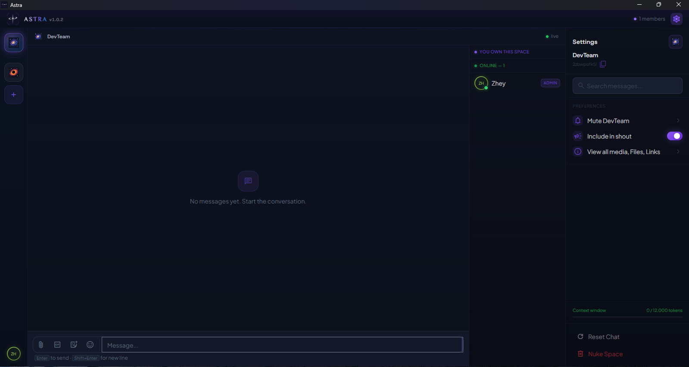
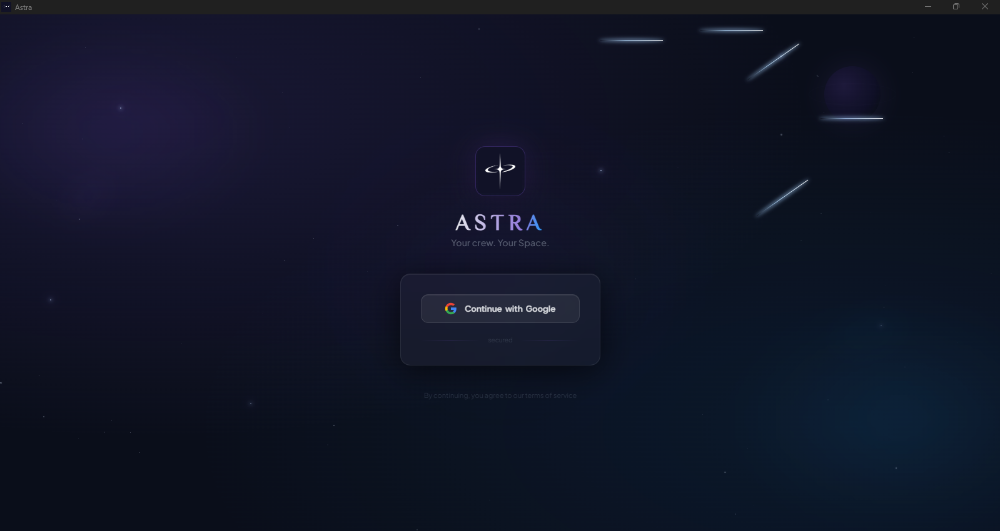
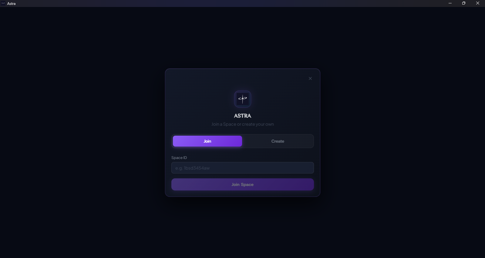
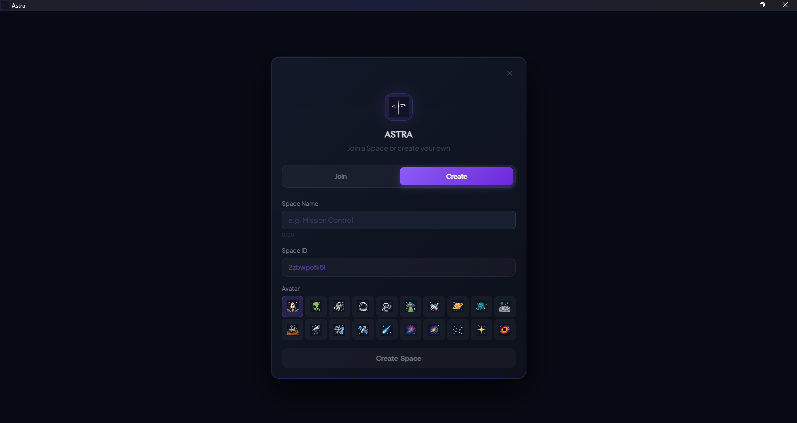

# Astra

**Desktop push alerts for your closest friends.**

You message someone. They are coding, gaming, or deep in a work task. They do not see it. You ping again. Still nothing. You ping again. Now you are the annoyance.

Astra solves this. **Every message locks onto their screen.** No tabs, no browser, no "did you see my message?" — just a fullscreen popup that demands attention.

---

## The Problem

Modern chat apps live in browser tabs. Browser tabs get minimized. Minimized tabs do not notify. Your friend is 3 meters away, fully absorbed in their PC, and has no idea you sent something urgent.

## The Solution

**Astra sits in the system tray, always connected.** When you send a `/shout`, `/tap`, or `/all`, a fullscreen notification pops up on your friend's PC — even if their window is minimized, even if they are in another app entirely. The message does not wait for them to check. It finds them.

---

## Product Tour

### Sign In

### Join or Create a Space

| Join a space | Create a space |
|---|---|
|  |  |

### Chat Dashboard

---

## Features

### Instant Screen Alerts
| Command | What it does |
|---|---|
| `/shout` | Fullscreen popup on every member's screen — loud, orange, impossible to miss |
| `/tap`  | Private fullscreen popup sent to one specific person — purple, intimate |
| `/all`  | Broadcasts to the entire space with an @all mention — green, everyone gets pinged |

All three use Supabase Realtime to push instantly to every connected client. The popup appears in under a second, with a countdown and a click-to-dismiss. Your friend sees it even if Discord, Slack, and every other app is running in the background.

#### `/shout`

#### `/tap`

### Message Actions (Hover Menu)

Hover over any message to reveal a compact action bar:
- **Quick reactions** — tap one of three presets (❤️, 😂, 😢) for instant feedback without opening a picker
- **Add reaction** — full emoji grid to react however you want
- **Reply / Edit** — Reply to others' messages, edit your own
- **More menu** — Copy text to clipboard, or delete a message you sent
- **Link detection** — any URL pasted into a message is automatically highlighted and clickable

### Real-Time Chat
- **Multi-space messaging** — Each space has its own history and member list.
- **Messages arrive instantly** for all online members.
- **Infinite scroll** — Pull older messages on demand, 100 at a time.
- **@mention autocomplete** — Type `@` to see and select member suggestions.

### Rich Messaging
- **Emoji picker** — Browse and insert any emoji from a curated grid.
- **GIF search** — Search GIPHY and Tenor simultaneously in a split view.
- **Sticker search** — Find and send stickers via GIPHY.
- **Image sharing** — Drag-and-drop images directly into chat.
- **Typing indicator** — See when others are composing.

### Space Details Panel

Every space has a browsable **Media / Files / Links** panel:

- **Media** — A grid of every image and GIF shared in the space, grouped by sender. Click any thumbnail to open it.
- **Links** — A full list of every URL ever posted in the space, with a click to open in your browser.
- **Files** — A dedicated space for file attachments (placeholder for future upload support).

### Smart Notifications
- **Smart dual-path** — App is focused? In-app toast. App is in the tray? OS native notification. Both always fire.
- **@mention bypasses mute** — Mute a space and normal messages go silent. But @yourusername still notifies, just like Discord.
- **Separate sound effects** — Unique sounds for incoming messages, shouts, and taps.
- **Per-space mute** — 15 minutes, 1 hour, 24 hours, or indefinitely.

### Space Lifecycle
- **Join and leave announcements** — Randomly selected space-themed messages like "breached the room" or "blinked off the radar" appear when members enter or exit.
- **Live members panel** — Real-time subscription keeps the online list current without manually refreshing.

### Space Management
- **Create a space** — Name it, pick from 20 custom space-themed SVG icons.
- **Rename, re-icon, or delete** — Change a space's identity at any time.
- **Kick members** — Admins can remove anyone.
- **Reset chat** — Wipe a space's message history with a confirmation step.
- **Leave space** — Clean exit with a random goodbye message.

---

## System Integration

- **System tray** — Right-click to open or quit. Single-click toggles the window.
- **Auto-start on boot** — Astra registers itself in Windows login items. It launches hidden in the tray on every startup and stays connected, ready to receive shouts.
- **No window on boot** — App starts fully hidden, like Epic Games or Riot. It wakes up silently when someone needs you.
- **Frameless titlebar** — Custom chrome with minimize, maximize, and close buttons.
- **Debug window** — Press F1 to open the built-in debug console.
- **Deep-link OAuth** — Google sign-in completes via `astra://` protocol, no browser tab left open.
- **Dark Orb UI** — Deep space dark theme with translucent frosted-glass bubbles, purple accent color, orange shout highlights, and green tap highlights. Custom scrollbars and Material Symbol icons throughout.

---

## Download

Download the installer from the [Releases page](https://github.com/ZheyUse/walkie-chattie/releases).

The installer is `Astra Setup X.X.X.exe` — run it and Astra will install to your machine. After the first install, Astra checks for updates on every launch and downloads new versions automatically in the background. You will be prompted to restart when an update is ready. No manual downloads needed after the first time.

---

## Who is Astra for?

Astra is built for **small, tight-knit groups** — gaming squads, dev teams, close friends. Not for large communities or public servers. Think of it as a chat app with the urgency of a group DM and the reach of a server, but without the cognitive overhead of either.

---

*No bots. No channels. No roles. Just your crew, and a way to reach them.*
